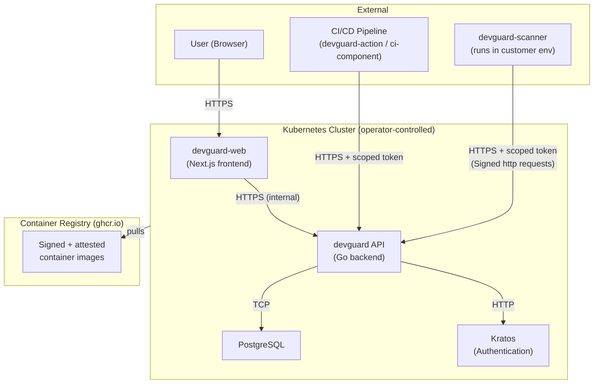

---
# Date this threat model was last reviewed and updated.
# Machine check: assert date is not older than 12 months. Additionally,
# the git log of this file is inspected — the last commit touching this file
# must not predate this value, ensuring the field is not stale.
last_reviewed: 2026-03-20
---

# Threat Model

DevGuard handles sensitive data including vulnerability findings, API tokens, deployment metadata, and access to customer repositories. The threat model covers the backend API, web frontend, scanner CLI, and the Kubernetes deployment.

## Architecture & Trust Boundaries

## Trust Boundaries

- **External users** interact with the web frontend over HTTPS. Authentication is handled by Kratos (OIDC, passkeys, passwords).
- **CI/CD pipelines** authenticate to the DevGuard API using tokens scoped per asset.
- **The scanner** runs in customer environments and communicates outbound to the DevGuard API using signed HTTP requests. It never receives inbound connections.
- **The Helm chart deployment** runs in an operator-controlled Kubernetes cluster. Database credentials and secrets are injected via Kubernetes Secrets, never hardcoded.

## STRIDE Analysis (Key Threats)

| Threat | Component | Mitigation |
|---|---|---|
| Spoofing | API token authentication | Tokens are scoped, short-lived, and stored hashed |
| Tampering | SBOM and provenance data | Cosign signatures on all artifacts; verified on ingest |
| Repudiation | Vulnerability findings | All findings are timestamped and linked to a specific pipeline run |
| Information Disclosure | Customer vulnerability data | Row-level access control; data isolated per organization |
| Denial of Service | API | Rate limiting; Kubernetes resource limits defined in Helm chart |
| Elevation of Privilege | Kubernetes deployment | Non-root containers; read-only root filesystem where possible; network policies enforced |